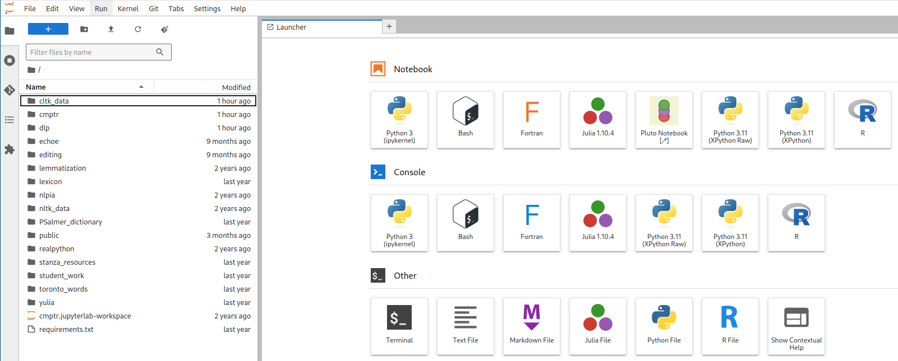

% Software
% P. S. Langeslag
% revision of \today

<!-- Process file as `pandoc -o Software.pdf Software.md --pdf-engine=xelatex --filter pandoc-crossref`. -->

---
documentclass: article
mainfont: Junicode
sansfont: "Noto Sans"
monofont: "DejaVu Sans Mono"
figPrefix:
    - "Figure"
    - "Figures"
tblPrefix:
    - "Table"
    - "Tables"
header-includes:
	- |
	  ```{=latex}
	  \definecolor{burgundy}{HTML}{990000}
	  \definecolor{darkgreen}{rgb}{0,0.422157,0}
	  \definecolor{mintgreen}{HTML}{40a170}
      \usepackage{hyperref}
	  ```
urlcolor: burgundy
highlight-style: tango
toc: true
subtitle: "Guide for students of Evaluating Historical Text Corpora"
---

# Overview

This course will have you writing and running Python code. The present document describes how to get set up with software to do so. If you're new to this sort of thing, set aside plenty of time to get set up, ideally before the start of term! If you run into any obstacles, that will be your opportunity to practise formulating your issue and finding solutions online.

# Anaconda

To start out, we will need a Python distribution set up to work with Jupyter notebooks, and ideally with Python environments as well. To keep this section brief, I will only offer instructions for Anaconda here. If you prefer other approaches, see [Appendix 1: Python without Anaconda].

To install Anaconda, head to [anaconda.com](https://www.anaconda.com/) and select "Free Download", look for the small print to "skip registration" to download the installer without sharing your email address (unless you don't mind), and select your operating system and processor architecture. You will need a few gigabytes of free disk space. When opening Anaconda Navigator, you can, if you like, dismiss prompts to set up an account to gain access to AI assistance and other online features. At this point you may want to update Anaconda Navigator to the latest version before undertaking further action.

# Python Environments (Optional)

In order to manage version requirements and avoid library conflicts, it is best practice to set up distinct Python environments for your various Python needs; for instance, you could create one environment `nlp` for most of your natural language processing needs, and another, say `nlp39`, for NLP tasks requiring the older Python version 3.9. [This guide](https://docs.anaconda.com/navigator/tutorials/manage-environments/#creating-a-new-environment) walks you through the process of creating a new environment in Anaconda. If you do create a custom environment, you'll always need to check that the correct environment is activated when starting work or installing a new library, as libraries installed in one environment won't exist in another. If you choose not to create a custom environment, Anaconda will have you working in a default environment entitled `base`.

# VS Code

In all my in-class instruction, I will assume that you are working in [Visual Studio Code](https://code.visualstudio.com/) (aka VS Code or Code). VS Code is an integrated development environment (IDE), essentially an advanced code editor. You are welcome to use any other Jupyter-compatible editor if you are prepared to port all instructions accordingly.

To install Visual Studio Code, look for it in your operating system's package manager (app store) or user repository, or else find it at <https://code.visualstudio.com>. Please note that several implementations of the app are available, and keyboard shortcuts given below will not work on all of them, or in all language editions.

Once you have it installed, launch Code and open the extensions manager (`Ctrl+Shift+X`) to install the extensions entitled Python (by Microsoft), Python Environments (by Microsoft; agree to install the pre-release if no final release is available), and Jupyter (by Microsoft). _If you cannot find Python Environments, it may be because you have installed the open-source implementation of VS Code rather than the proprietary Microsoft release. You can try installing another Python environments extension, such as that by Solarzano-JuanJose, and see how you fare._ You now have what you need to write Python in VS Code; let's get you the course materials next.

_As you start using it, VS Code may prompt you to install the `ipykernel` extension. If so, assent._

# Git

I strongly advise you to set up Git, not only because I will be distributing my code examples and documentation through a [repository](https://github.com/langeslag/ehtc) hosted on GitHub, but also because you will be running code that clones additional repositories. To [install](https://git-scm.com/book/en/v2/Getting-Started-Installing-Git) and [configure](https://git-scm.com/book/en/v2/Getting-Started-First-Time-Git-Setup) Git, follow the instructions in [the Pro Git book](https://git-scm.com/book/en/v2). Once you have it installed, configuration can be as simple as entering two lines like the following into your terminal (or entering your name and email into a graphical configuration assistant):

```bash
git config --global user.name "Firstname Lastname"
git config --global user.email your.email@stud.uni-goettingen.de
```

# Python Package Management

For Python package management using the Anaconda distribution, you have three options available to you. If you lack experience working on the command line, you may use Anaconda Navigator to install and manage libraries in the Environments tab, or in your Jupyter notebook you can issue commands like `%conda install matplotlib` directly within your code cells to install the library called `matplotlib` (though you may experience issues with that on Windows).

Traditionally, however, Python package management is done from the command line, using the command `conda install` (or `pip install` if that's the route you have chosen). You can access a terminal from within VS Code, but if you are using Windows, integrating Anaconda shells into VS Code appears to be a bit of a headache, so the easiest solution is to (install and) run any one of the terminal/shell options (PowerShell, `CMD.exe`, etc.) you can find in Anaconda Navigator. You can then install individual packages by issuing commands like `conda install matplotlib`.

If in your work you ever encounter an error along the lines of `ModuleNotFoundError: No module named 'gensim'`, simply install the missing package (`conda install gensim` on the command line, or `%conda install gensim` in your notebook) and get on with your work.

Remember that Python packages are only available within the Python environment in which they were installed; so ensure the the kernel selected in the top right corner of VS Code corresponds to the environment to which you installed your libraries.

There are a few complications with package management using `conda`. First, some packages are distributed through distribution sources (or "channels") other than `defaults`, and these you will not find by giving the package name as an argument to `conda install`, or by searching the package database in Anaconda Navigator. Specifically, to install `pyLDAvis`, issue `conda install conda-forge::pyldavis`.

Second, some packages are not available through `conda` at all, so you will have to install them using `pip`. Specifically, `pip install pymediawiki`.

And finally, a small number of demo notebooks used in this course rely on an old version of CLTK, which in turn requires that you install an old version (3.9) of Python. If you have need of this library, first set up an environment running Python 3.9, then install CLTK by issuing `pip install cltk==1.5.0`.

# Cloning the Course Repository

To obtain the course files from within VS Code, make sure you close any open projects/folders (File &gt; Close Folder, or `Ctrl+K Ctrl+F`), then navigate to Source Control (`Ctrl+Shift+G`) in the lefthand pane, select "Clone Repository", and paste in `https://github.com/langeslag/ehtc.git`. If Git is correctly set up, the course files should now be downloaded into a folder of your choice and listed in the documents pane. Alternatively, you can use the command line: in your terminal (i.e. Terminal in macOS, or PowerShell in Windows), navigate to your course folder, then enter `git clone https://github.com/langeslag/ehtc.git`; then if you open the resulting subfolder in VS Code, it should recognize it as tracking a remote repository. If for any reason you cannot get beyond this step, you can visit <https://github.com/langeslag/ehtc/>, select "Code" and "Download source code: zip", and extract the archive to a location of your choice. Just remember to redownload any changed files down the road, and be advised that several of our demo notebooks and templates depend on Git working.

Once you have the repository linked to your VS Code project, you can update to the latest state by clicking "Pull" in the Source Control pane, or clicking "Sync Changes" whenever it appears. Please be advised that if you ever run and save, or otherwise modify, files from the course repository, you will run into a conflict the next time you pull from remote. To avoid this happening, you can duplicate the file you want to run or modify, giving it a new name and leaving it untracked; untracked files are marked `U` in Source Control. Ideally, you'll want to keep all your files in the `project/` folder, which has been initialized as an empty folder with contents explicitly untracked for this exact purpose, and you'll want to store your text corpora in `corpora/` which has been initialized in the same way. If you ever run into a conflict because you have mistakenly modified a tracked file, you can strip your working copy of local changes by entering `git reset --hard` on the command line from within your project folder (this will not affect untracked files, so your own files should be safe).

# Appendix 1: Python without Anaconda

If you prefer to use the more traditional `pip` package manager over `conda`, you will want to go over the [installation instructions at Real Python](https://realpython.com/installing-python/), or at least the briefer installation notes at the top of VS Code's [Get Started With Python tutorial](https://code.visualstudio.com/docs/python/python-tutorial). You will have to install Jupyter Notebooks separately. Basic installation instructions are at [jupyter.org](https://jupyter.org/install), but they assume you are comfortable with Python package management already; `pip` instructions are [here](https://pip.pypa.io/en/stable/getting-started/), and even they assume you know to open a terminal and issue your commands there; as per usual, the relevant [Real Python article](https://realpython.com/what-is-pip/) has more detail. If you want to create a custom Python environment using `pip`, consult [the relevant Real Python article](https://realpython.com/intro-to-pyenv/) for guidance.

# Appendix 2: JupyterLab Remote

If you run into any insurmountable issues when trying the local install, you can do your work in the cloud using [JupyterLab](https://jupyter-cloud.gwdg.de), where Python, Jupyter, and Git come pre-installed. The main drawback to going this route is that although your work and your corpora are safely stored, Python packages are lost between sessions and will have to be reinstalled every time you do a stint of work.

## Accessing JupyterLab Remote

To use GWDG's instance of JupyterLab, first activate your GitLab account by logging in at <https://gitlab.gwdg.de> using your customary university credentials if you have never done so before. Then log in at <https://jupyter-cloud.gwdg.de>. You may select the default image when prompted. If you aren't returning to an active or saved workspace, JupyterLab should open to a launcher window resembling @fig:interface.

## Cloning the Course Repository

In the JupyterLab launcher window, from the category "Other" select "Terminal". This opens a command-line interface answering to many of the same commands you may know from UNIX-like systems such as Linux or macOS. To clone the repository, paste the following command into your JupyterLab terminal and hit Enter:

```bash
git clone https://github.com/langeslag/ehtc.git
```

This should create a folder `ehtc/` and populate it with our course files. The folder will appear in the file system in the left-hand pane. Once it's done cloning, you can close the terminal window (click `x` or type `exit`) and double-click the `ehtc/` folder on the left. Nothing changes except the current folder (or "working directory"). Now if you start Python 3, the files you've pulled in are available within your working directory.

{#fig:interface}

If the course materials should ever be updated in the course of the term, you'll have to update your working copy to take advantage of these changes. To do so, enter the `ehtc/` folder in the file system, launch a terminal window, and enter `git pull`. Once the line `Writing objects` reaches 100%, your working copy is up to date and you can close the window. If you receive a warning that your working copy contains changes not in the master branch, you can override changes you made to the distributed files by issuing `git reset --hard`. Do make sure not to lose any of your own work; this can easily be avoided by writing only to files with file names other than those supplied as part of the repository (use the `project/` and `corpora/` folders), and never taking action to add your own files to the repository's tracked files (i.e. never issue `git add`).

## Package Management

Our textbooks assume that you have access to a Python package manager, usually `pip` or `conda`, on the command line. GWDG's remote instance of JupyterLab in fact incorporates `pip` directly into the interpreter, so to install a Python package like `lexicalrichness` you can type `!pip install lexicalrichness` directly into your notebook or console, or you can take the more conventional route and do your package management from within a terminal window using commands like `pip install lexicalrichness`.

The remote instance of JupyterLab does not save your Python libraries: the next time you log in, your packages will be gone. So it pays to learn to [generate `requirements.txt`](https://www.freecodecamp.org/news/python-requirementstxt-explained/), a list of libraries you can then install all at once whenever you need to by entering `pip install -r requirements.txt`.
